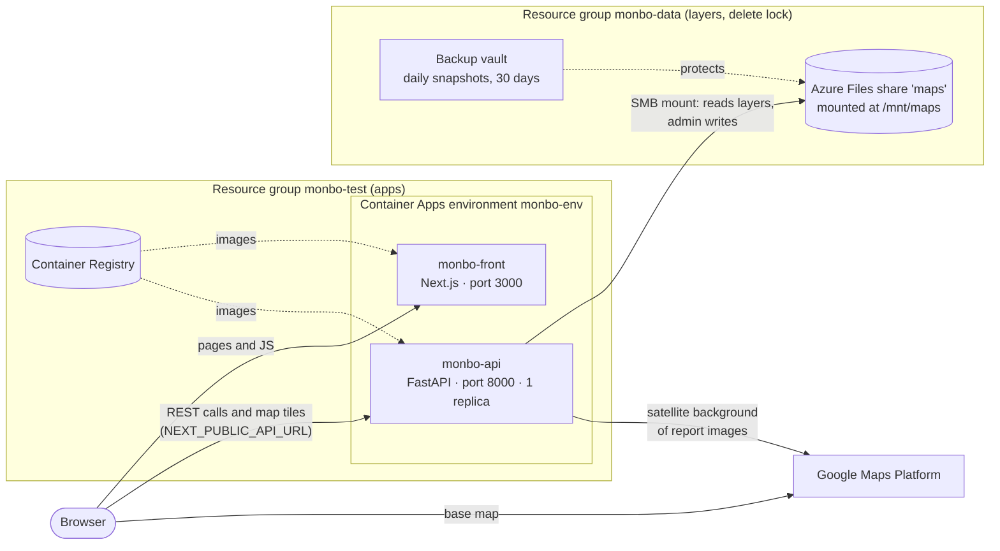
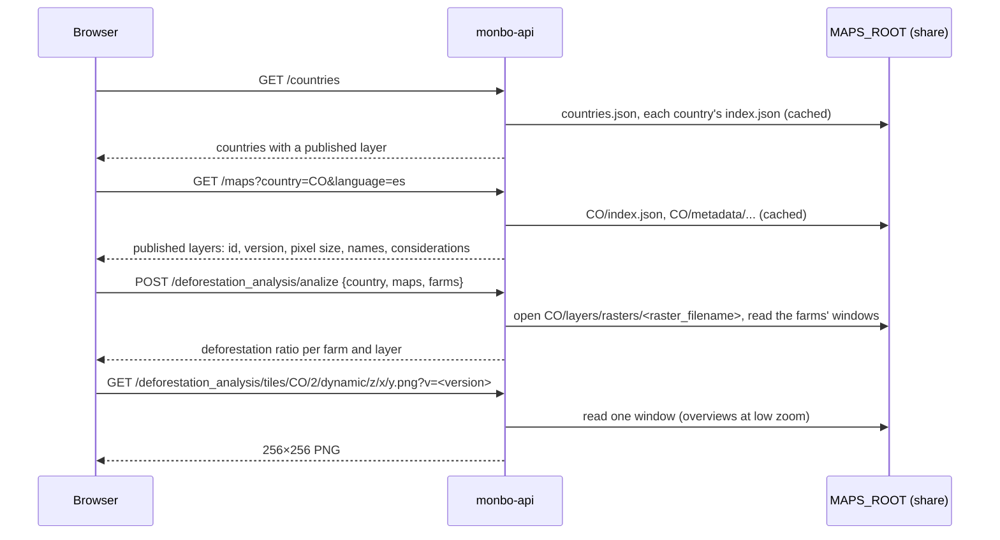
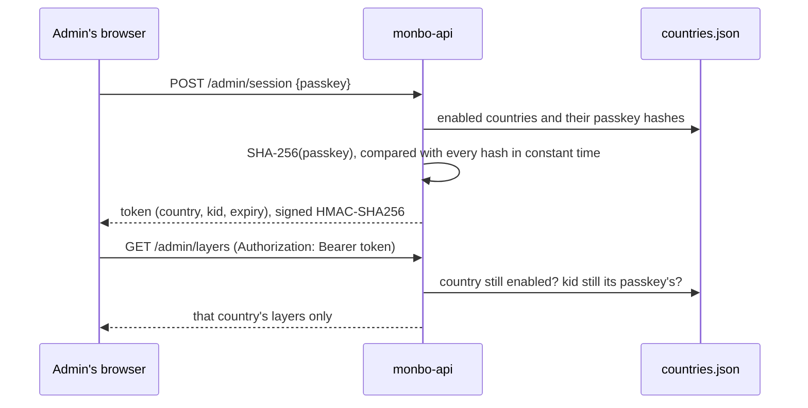
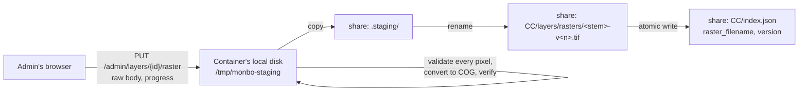

# Architecture and infrastructure

How Monbo is deployed, how its pieces talk to each other, how the API reads the
deforestation rasters, and how each country administers its own layers. Step-by-step
procedures live elsewhere and are linked from each section:
[suggested_deployment.md](suggested_deployment.md) (deploying),
[maps.md](maps.md) (managing layers) and [onboarding.md](onboarding.md) (running it
locally).

## The big picture

Monbo has two applications and no database:

- **monbo-front** (Next.js) serves the pages. It holds the user's analysis in the
  browser only: nothing about farms is stored on the server.
- **monbo-api** (FastAPI) parses the farm files, validates polygons, runs the
  deforestation analysis, serves the map tiles and draws the report images.

The only server-side state is the **deforestation layers**: rasters, their metadata
and the country registry, all files under `MAPS_ROOT`. In Azure that is an Azure
Files share; locally it is a folder.

The browser calls the API directly: the frontend container only serves pages and
static files, it doesn't proxy API calls. That is why the API's URL is a
`NEXT_PUBLIC_` variable.

## Azure resources

Everything is created and updated by `azure/deploy.sh` (idempotent), with the
settings in `azure/deploy.env`. One `deploy.env` describes one environment
(subscription, resource group names, storage account); the default names below are
those of the development environment.

### Apps: resource group `monbo-test`

| Resource | What it does |
|---|---|
| Container Registry (`ACR_NAME`, Basic) | Holds the `monbo-api` and `monbo-front` images, tagged with the Git commit (`TAG`, default `git rev-parse --short HEAD`). The apps pull them with the registry's admin credentials, stored as a Container App secret. |
| Container Apps environment `monbo-env` | Shared network and logging for both apps (a Log Analytics workspace created with it). It also registers the share as environment storage `maps`, which the API's volume refers to. |
| Container App `monbo-api` | 1 CPU / 2 GiB, external HTTPS ingress to port 8000, **exactly one replica**. Startup, readiness and liveness probes on `/health`. Mounts the share at `/mnt/maps` and sets `MAPS_ROOT` to it. |
| Container App `monbo-front` | 0.5 CPU / 1 GiB, external HTTPS ingress to port 3000, one replica, health check on `/api/health`. |

The API app is written whole from `azure/render_api_app.py` (an `az rest` PUT),
because volumes can't be added with `az containerapp` flags. The frontend app is
updated with `az containerapp update`.

**Configuration and secrets.**

- **API:**
  - Container App secrets: the Google Maps key and signature secret, the registry
    password, and `ADMIN_SESSION_SECRET`. They are referenced by environment
    variables and read at container start, so `deploy.sh` restarts the revision.
  - `ADMIN_ALLOWED_ORIGIN` is set to the frontend's URL.
- **Frontend:**
  - It is built once with placeholders (`__NEXT_PUBLIC_API_URL__`…).
  - At start, `monbo-front/entrypoint.sh` replaces them with the container's
    environment variables, so the same image runs in any environment.
  - Its Google Maps key is exposed to the browser by design.

### Layers: resource group `monbo-data`

Kept apart from the apps so that `./azure/deploy.sh destroy` (which deletes
`monbo-test`) can't touch the layers.

| Resource | What it does |
|---|---|
| Delete lock `monbo-data-no-delete` | Nothing in the group can be deleted by mistake. |
| Storage account (`STORAGE_ACCOUNT_NAME`) and share `maps` | 10 GiB SMB share, TLS 1.2+, soft delete for 14 days. Holds the per-country layout ([maps.md](maps.md#per-country-layout)). |
| Backup vault `monbo-backup`, policy `maps-daily-30d` | A snapshot of the share every day at 06:00 UTC, kept 30 days. |

The share is mounted with `uid=10001,gid=10001`: the API image runs as that user,
and `chmod` isn't possible on Azure Files. Details, first-time setup and rollback are
in [suggested_deployment.md](suggested_deployment.md).

### Why the API runs as a single replica

Several things live in the API process's memory:

- the lock that serializes writes to the share;
- the cached registry and indexes;
- the login rate limit;
- the single raster ingestion slot.

A second replica would have its own copies and could corrupt the share or run two
ingestions at once. Don't scale the API out while the admin is enabled.

### What survives what

| Event | Effect |
|---|---|
| New revision or restart of the API | Layers, admin edits and ingestion job history are on the share and stay. An ingestion that was running is marked failed ("interrupted by restart") and its staging file is deleted. |
| `./azure/deploy.sh destroy` | Deletes the apps. The share and its backups stay. |
| Someone deletes a file on the share | Restore it from a snapshot (vault "Restore"). |
| Someone deletes the share | Undelete it within 14 days (soft delete). |

## Where the API reads layers from

`MAPS_ROOT` decides it. At startup, the API detects the layout:

| Layout | Where | What works |
|---|---|---|
| Per country: `countries.json` plus one folder per country | Azure (`/mnt/maps`); locally `.local-maps` | Everything, including the admin |
| Flat (legacy): one `index.json` at the root | Locally the default (`app/maps`, tracked in Git with LFS). The API image carries no layers | Public app only, read-only; the admin routes are not registered |

A root holding both layouts is refused at startup, and so is one holding neither (an
empty or missing `MAPS_ROOT`). `GET /health` reports the root in
use and whether it is writable.

All file access goes through `app/modules/layers/store.py`:

- `LayerStore` handles one folder (a country, or the flat root);
- `LayersRoot` handles the whole root, the registry, and finding a layer by country
  and id.

## How the app reads a layer's raster

A layer is identified by **its country and its id**: each country numbers its layers
from 0, so `CO/2` and `EC/2` are different layers. Every request that touches a
raster carries the country (the frontend sends the one selected on the landing page).

### 1. Finding the layers

- **`GET /countries`**: the enabled countries with at least one enabled layer. The
  landing page shows one card per country from it.
- **`GET /maps?country=CO&language=es`**: Colombia's enabled layers, with their
  metadata in the requested language and their `version`.

The registry and each index are parsed once and **cached while the file's
modification time and size don't change**, so most requests don't open them. An
unreadable registry keeps the last valid copy, so a bad edit doesn't take the app
down.

### 2. The analysis

`POST /deforestation_analysis/analize` with the country, the layer ids and the farms.
For each requested layer of that country:

1. Its raster is resolved as `<MAPS_ROOT>/<CC>/layers/rasters/<raster_filename>`
   (from the index entry) and opened once with rasterio.
2. For each farm, its polygon (or a circle of the farm's radius around its point) is
   reprojected to the raster's CRS, and `rasterio.mask(crop=True, all_touched=True)`
   reads only the pixels inside it.
3. The ratio is the number of pixels equal to `1` (loss), times the pixel area
   (`pixel_size`² from the index), divided by the farm's area, capped at 1.

Rasters are Cloud Optimized GeoTIFFs (512×512 tiles, DEFLATE compression), so only
the tiles that cover a farm are read from the share, not the whole file.

### 3. Map tiles

`GET /deforestation_analysis/tiles/{country}/{id}/dynamic/{z}/{x}/{y}.png`:

- The API opens the raster through a `WarpedVRT` in Web Mercator.
- It reads the tile's window resampled to 256×256 with nearest neighbour, and paints
  the loss pixels red on a transparent PNG.
- At low zoom it reads the COG's overviews instead of the full resolution.
- A tile outside the raster is an empty PNG.

Tiles are cached by the browser for a day. The frontend adds the layer's `version`
to the URL (`?v=<version>`), so a new raster isn't hidden behind cached tiles.

### 4. Report images

`POST /deforestation_analysis/generate-image` (feature, layer id, country) draws the
raster around a farm on top of a Google Maps satellite image (Static Maps API, with
the API's key and signature secret), for the PDF report.

### Raster versions and concurrency

- Each raster upload is stored under a new name, `<stem>-v<version>.tif`.
- Activating it is one atomic write of the country's `index.json`
  (`raster_filename`, `version`). Requests read the index again on their next call
  and open the new file.
- A request that already opened the old file keeps reading it: the old versions are
  never overwritten or deleted.
- That is why raster reads take no lock.

A layer created in the admin starts at version 0 and has no raster, so it can't be
published until its first raster (v1) is uploaded.

## How the per-country admin works

Each country administers its own layers at `https://<frontend>/admin`, with its own
passkey. There are no user accounts: one passkey per country, shared by that
country's admins.

### The country registry

`MAPS_ROOT/countries.json` lists each country's ISO 3166-1 alpha-2 `code`, the
**SHA-256 of its passkey** (never the passkey) and whether it is `enabled`.

- It is managed only with the countries command:
  - locally, `uv run python -m app.modules.admin.countries add|list|rotate|disable|enable`;
  - in Azure, `./azure/deploy.sh countries …`, which edits the registry on the share
    under a file lease and an ETag check, so two operators can't overwrite each
    other.
- `add` creates the country's empty folder and prints its passkey **once**.
- The running API picks up any change on its next request (the cache is keyed on
  the file), with no redeploy or restart.

| Action | Effect |
|---|---|
| `add PE` | New country with an empty folder. It appears on the landing page once its admin publishes a layer. |
| `rotate CR` | New passkey for Costa Rica; its admins are signed out at once. Other countries are untouched. |
| `disable EC` | Ecuador disappears from the public app and its admin is locked out. Its data stays, and its layers still resolve for analyses already open. |
| Rotating `ADMIN_SESSION_SECRET` | Every admin of every country is signed out. |

### Logging in and the session

- **Login.**
  - The API hashes the passkey and compares it with every enabled country's hash,
    without stopping early. The passkey alone tells which country it is.
  - Failed logins are limited to 5 per client IP per 15 minutes.
- **Token.**
  - It carries the country, `kid` (the first 16 characters of that country's
    passkey hash) and an expiry (`ADMIN_SESSION_TTL_MINUTES`, 60 by default).
  - It is signed with `ADMIN_SESSION_SECRET`.
- **Every admin call** checks:
  - the signature and the expiry;
  - that the country is still registered and enabled;
  - that `kid` still matches its passkey hash.

  That is what makes `rotate` and `disable` take effect immediately.
- **Origin.** With `ADMIN_ALLOWED_ORIGIN` set, admin calls from another origin are
  rejected (403). CORS stays open for the public routes, without credentials.
- **Opt-in.** The admin only exists when `ADMIN_SESSION_SECRET` is set and the root
  has the per-country layout. Otherwise the `/admin` API routes aren't registered.

In the frontend:

- the token lives in `sessionStorage` (closing the tab signs out), and it is checked
  again with `GET /admin/session` when the page loads;
- any 401 goes back to the login;
- the header shows the administered country.

### What an admin can touch

Every admin route works on **the session's country only**:

- **Layers:** listing, creating (the next id in that country), editing fields and
  metadata, and publishing or hiding. They all use `<CC>/index.json` and
  `<CC>/metadata/`.
- **Rasters:** uploads go to that country's folder.
- **Other countries:** an id or a job of another country answers 404, as if it
  didn't exist.

Writes to the share hold one process-wide lock. Each file is written to a temporary
name and renamed into place, retrying when the SMB mount refuses the rename because
another handle has the file open. Metadata is written before the index, so the index
never points at a missing file.

### Raster uploads

1. The browser sends the file as the raw request body. The API streams it to the
   container's **local disk** (`ADMIN_STAGING_DIR`), up to `ADMIN_MAX_UPLOAD_MB`
   (500 MB).
2. A background job validates it on that disk, much faster than over SMB:
   - one integer band and a CRS;
   - only 0, 1 and nodata, every pixel checked;
   - a pixel size matching the layer's.

   It then converts the raster to a COG and checks the conversion pixel by pixel.
3. Only the verified COG is copied to the share and renamed to its versioned name.
   The index is then updated in one write.
4. The job's state is kept in `.jobs/` on the share:
   - its status, its phase (validating, converting) and its validation progress;
   - an error or warnings, if any.

   The admin UI polls it and can cancel it until the raster is activated.
5. **Only one ingestion runs at a time, across every country**; another upload gets
   409.

The rules and what each check means are in [maps.md](maps.md#raster-requirements).

### Adding a country

1. `./azure/deploy.sh countries add PE`, and give the printed passkey to Peru's
   admin through a password manager.
2. Peru's admin logs in, creates its layers and uploads their rasters (the current
   GFW and TMF rasters only cover Ecuador, Colombia and Costa Rica).
3. Once a layer is published, Peru appears on the landing page.

No code change or redeploy is needed.

## Local development

The same API runs locally with `MAPS_ROOT` pointing at a folder:

- the Git-tracked `app/maps` (flat, read-only, no admin) by default;
- or a per-country copy in `.local-maps` to try the admin.

The frontend calls the API at `NEXT_PUBLIC_API_URL`. See
[onboarding.md](onboarding.md#48-trying-the-layers-admin-locally).
